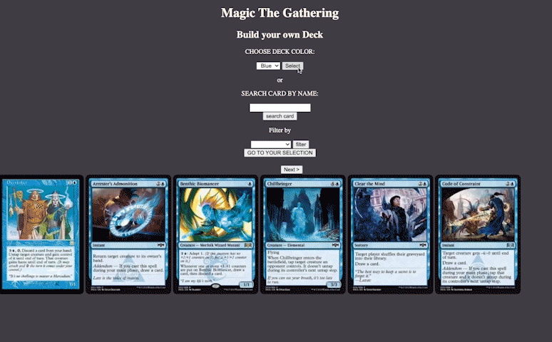

# Build your own hand - Magic The Gathering

 

API documentarion: https://docs.magicthegathering.io/

 

1. As a user I'll be able to select a color I want to build my hand out of
2. As a user I'll be able to sort the given selection of cards by a desired type
3. As a user I'll be able to add cards to a selection by clicking the cards
4. As a user I'll know which cards are selected because I'll see a green rim around them
5. As a user I'll also be able to see only my selected cards
6. As a user I'll be able to deselect cards by clicking on them again
7. As a user I'll be able to create a multi colored deck
8. As a user I'll be able to search cards by name
9. As a user I'll be able to move through different pages
    
    

## Installation

This app doesn't need to be installed, just open `index.html` in the browser.

 
 

## Stack

- [x] HTML/CSS
- [x] Vanilla JavaScript
